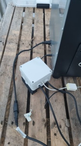

# PID regulator for electric smokers such as a Bradley

## Overview

I needed a way to keep the smoker above freezing while cold smoking in the winter. This is the solution.

### Hardware

#### BOM

**Build this device at your own risk - it switches deadly voltages and can kill you and cause fires if handled wrong!**

The hardware consists of three principal devices:

- an ESP8266 board, I happened to have a Wemos D1 mini around.
- a thermometer, the template assumes that it is a Dallas 1-wire device. **For cold smoking**, I use a [waterproofed assembly (aliexpress affiliate link)](https://s.click.aliexpress.com/e/_Dn2Jfsn), again, not a deliberate design choice but something I had around. Note that the 1-wire bus need a 4k7 resistor as pull-up.
- a solid state relay (SSR) rated for your smoker's power draw and voltage. I use a 10A SSR which is the fuse rating for my outlet. Please note, mechanical relays will not work!

Please note: If you intend to use the device for hot smoking, you **must replace the 1-wire thermometer with something that is rated for higher temperatures.**
It should be possible to use the smoker sensor directly by changing the template to [NTC with the correct values](http://www.outdoorsmenforum.ca/showthread.php?p=3793689) - I have not tested this. Another alternative is to use a [thermocouple](https://esphome.io/components/sensor/max6675.html) - again, not tested by me.

Additionally, you will need:

- an enclosure to protect you from the device
- Optional: extension cord for the thermometer to be able to place the device in a suitable location
- a power supply capable of delivering 5V to the ESP. 
- a suitable **grounded**  power cable, **grounded** plug and **grounded** socket
- ground wire ("green with yellow stripe" - color depending on your region of course) rated for power connection use
- cable-to-cable power connectors properly rated for your region
- ring connectors to connect the power cables to the SSR and the ground cables to screws. 
- thin gauge electric wire to connect the Wemos to the relay control port.
- screws, nuts, bolts, washers, cable ties, to mount things in the enclosure.
- shrink tubing to cover solder joints

Tools:

- drill, screwdriver, ratcheting crimp tool, pliers, wire cutter, soldering iron, multimeter.

#### Pre-flash Assembly

- Place all components in the enclosure to decide what goes where and where to make the holes for the cables
- Make holes in the enclosure for incoming, outgoing power and the thermometer.
- Mount the SSR solidly into the enclosure, attach grounding wires using ring connectors to all screws.
- Mount the PSU into the enclosure, attach grounding wires using ring connectors to all screws.
- Connect incoming power to the PSU.
- Connect incoming neutral wire to outgoing neutral wire
- Connect the incoming power live wire to the power side of the SSR
- Connect the outgoing power live wire to the power side of the SSR
- Solder R to D2 - It goes from 5V to the 1wire signal, an alternative is to add it to the thermometer extension joint instead.
- Extend the thermometer cable if needed. Use shrink tubing to cover all joints.
- Solder the thermometer cable to the ESP - Ground, 5V, and signal to ESP pin D2.
- Solder the signal wire for the SSR to ESP pin D1, solder the ground wire for the SSR to ESP signal ground.
- Connect the signal wire and ground wire to the SSR - pls note the polarity on the SSR.

**DO NOT connect the device to power, DO NOT connect the ESP to the power supply**

### Software

- Copy secrets.yaml.example to secret.yaml, use it to configure ssid, password, mqtt broker.
- If you do not use mqtt, remove the mqtt section from the smoker.yaml file
- The software is "off the shelf" ESPHome. Follow this guide to flash the device: [Getting Started with the ESPHome Command Line](https://esphome.io/guides/getting_started_command_line.html)
- Connect the device to your computer, flash the software, and check the logs.
- On the first run, the thermometer will not work. Check the ESPHome log for the proper value for the 1wire device id, and change the "address" in the smoker.yaml to the value of your device.
- Once running, you should be able to access the device web page and change the setpoint. The LED (if your SSR have one) on the SSR should turn on when the device is heating.
- Check that the thermometer reading is reasonable by looking at the device logs 

Disconnect the device from the computer, and continue with the next step.

### Hardware part 2.

**Make sure that your device is not connected to either wall power or the computer **

- Connect the PSU to the ESP. Depending on your PSU, you may have to solder the 5V leads to the device.
- Fix the ESP to the enclosure.
- Check all the connections.
- Tidy up the wires in the enclosure.
- Make sure that all devices are fixed in place.
- Check that no wires are uninsulated
- Check that no connectors are exposed or uninsulated
- Using the multimeter, test that your incoming ground - in the plug - reaches all connected points - screws as well as the output connector. 
- Close the enclosure.

## Testing

### Bench test

- Plug the device into a wall outlet. Check that the magic smoke doesn't escape the device
- Browse to the device's web server and check that it works, and that you still have a thermometer reading

### Hardware in the loop test

- Place the PID device in a stable, dry, and safe location.
- Place the thermometer in the smoker. I run it through the top vent, and use the second-from-the-top tray to make it dangle close to the wall. 
- Disconnect the normal smoker control box from the smoker heating power.
- Connect the PID power output to the smoker heating power.
- Check your connections, and plug in the device.
- Monitor the temperature, after a while it should settle around the setpoint.

### PID Tuning

- The PID can be autotuned - refer to the [ESPHome PID Climate pages](https://esphome.io/components/climate/pid.html#autotuning) for instructions.
- The supplied parameters work good enough for my Bradley digital 4 rack smoker - as shown for setpoint 18°C in the graph below.

